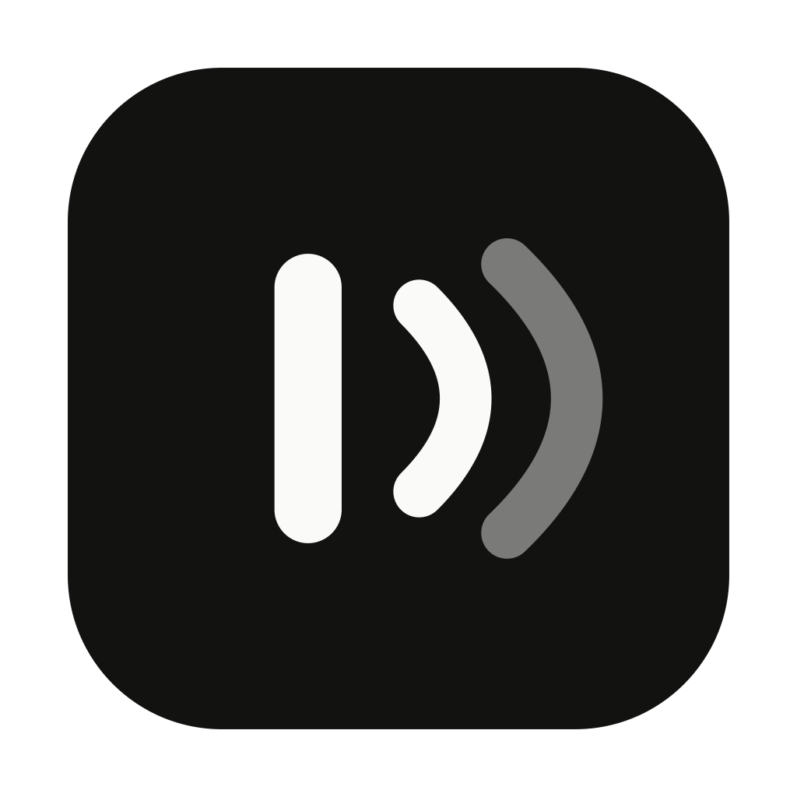
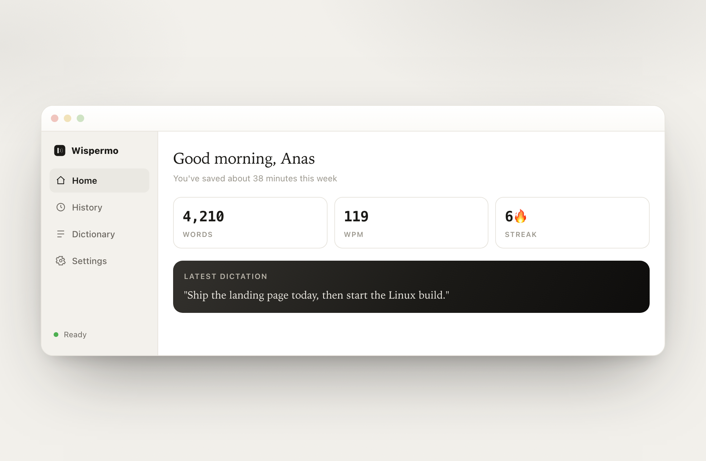
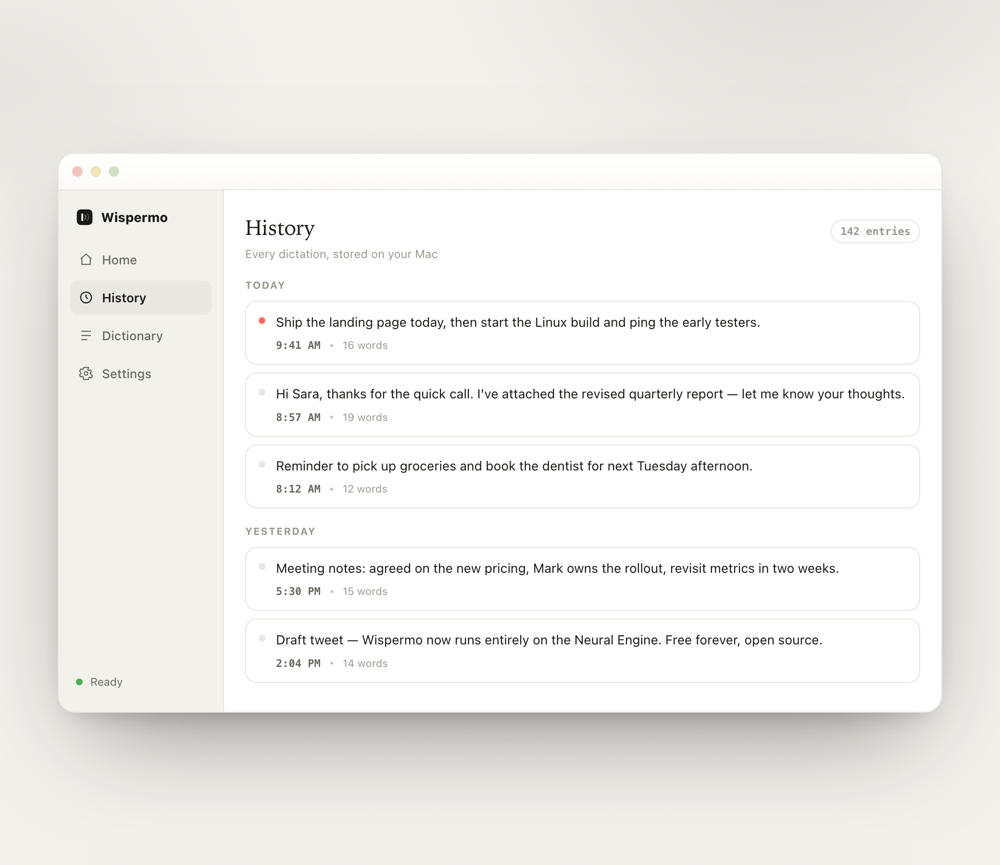
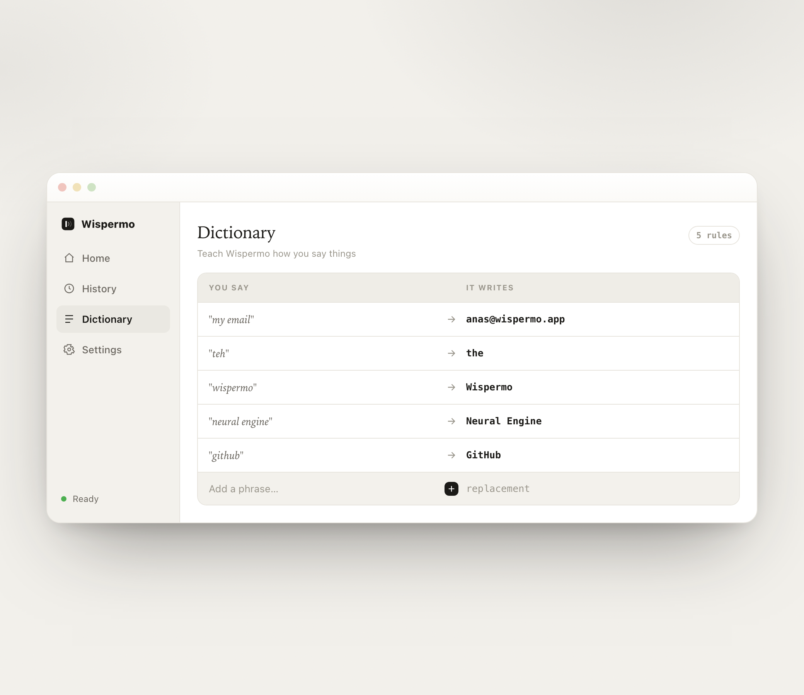
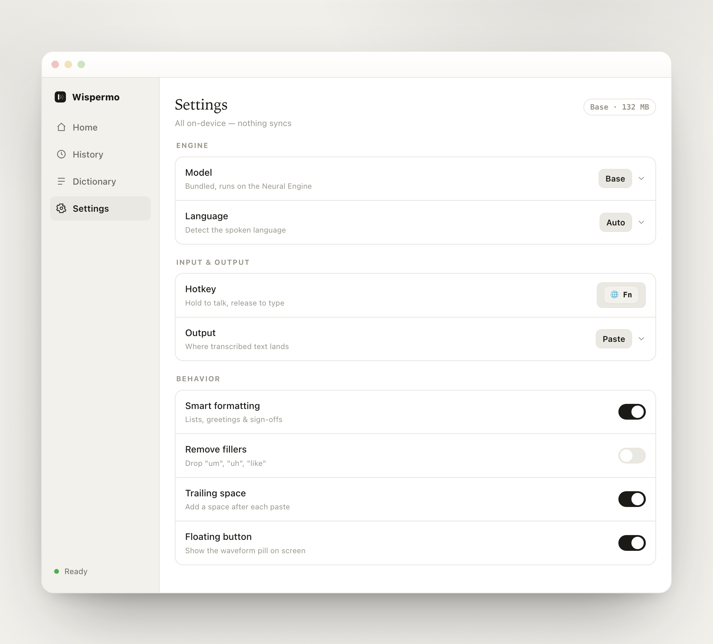

<div align="center">



# Wispermo

### Dictation that lives on your Mac. Free & open source.

Press a key, speak, and your words are typed into whatever app you're using —
instantly, privately, and **100% on-device**. No cloud. No account. No subscription.

[](https://github.com/FadiliAnas/wispermo/releases)
[](https://github.com/FadiliAnas/wispermo/releases)
[](LICENSE)
[](#)

**[⬇️ Download for macOS](https://github.com/FadiliAnas/wispermo/releases/latest)**



</div>

---

## What is Wispermo?

Wispermo is a native macOS app that turns your voice into text in **any** application.
Hold the globe / **Fn** key, talk, release — your speech is transcribed by a Whisper
model running locally on the Apple Neural Engine, cleaned up, and pasted at your cursor.

It's a free, open-source, privacy-first alternative to cloud dictation tools like Wispr Flow:
your audio and text **never leave your machine**.

## Features

- 🎤 **On-device transcription** — Whisper runs locally on the Neural Engine. Fast, accurate, and fully offline.
- 📦 **Plug-and-play** — the speech model ships *inside* the app. Drag to Applications and dictate. No model download, no first-run wait.
- ⌨️ **Press a key, speak** — a rock-solid global hotkey (globe / Fn). Toggle and push-to-talk modes.
- ✨ **Smart formatting** — say "point one… point two…" and get a numbered list. Bullets, email greetings & sign-offs, and spoken email addresses are detected automatically.
- 📋 **Pastes anywhere** — text lands at your cursor in mail, docs, chat, code. Choose instant paste, a typed-out effect, or copy-to-clipboard.
- 📖 **Custom dictionary** — teach it how you say names, jargon, and emails.
- 🧭 **Menu-bar native** — a small status item with the Wispermo mark sits up by your clock.
- 🕘 **History & stats** — searchable history, words dictated, WPM, minutes saved, streak.
- 🔒 **Private by design** — no account, no telemetry, no network calls. Open source — read every line.

## Screenshots

| Home | History |
|------|---------|
|  |  |
| **Dictionary** | **Settings** |
|  |  |

## Install

1. **[Download the latest `Wispermo.dmg`](https://github.com/FadiliAnas/wispermo/releases/latest)** (~132 MB — the speech model is bundled inside).
2. Open the DMG and **drag Wispermo into Applications**.
3. Launch it. The first time, macOS may show an "unidentified developer" notice — **right-click the app ▸ Open** to confirm. (The app is self-signed; a notarized build is on the roadmap.)
4. Grant the three permissions when asked:
   - **Microphone** — to hear you.
   - **Accessibility** — to paste/type into other apps.
   - **Input Monitoring** — to use the global hotkey.

That's it — no model to download, nothing else to configure.

## How to use

1. Put your cursor wherever you want text to appear (an email, a doc, a chat box, your editor).
2. **Hold the globe / Fn key** and speak. A small waveform appears at the bottom of the screen.
3. **Release** the key — your words are typed in, cleaned up and formatted.

**Modes** (Settings ▸ Input & Output):
- **Push-to-talk** — hold to record, release to insert.
- **Toggle** — press once to start, again to stop.

**Smart formatting examples** — Wispermo shapes what you dictate, on-device:

| You say | Wispermo types |
|---|---|
| "point one buy milk point two call sara point three send the report" | 1. Buy milk<br>2. Call Sara<br>3. Send the report |
| "bullet point review the PR bullet point deploy" | • Review the PR<br>• Deploy |
| "hi sara … thanks so much ahmed" | Hi Sara,<br><br>…<br><br>Thanks so much,<br>Ahmed |
| "email me at john at example dot com" | email me at john@example.com |

**Output options** — instant paste (default), a typed-out "writing" effect, or copy-to-clipboard only.

## Settings at a glance

- **Model** — tiny / base (bundled) / small / large-v3. (Non-bundled models download on demand.)
- **Language** — auto-detect or pin one of 14 languages.
- **Hotkey** — globe / Fn by default; toggle vs. push-to-talk.
- **Smart formatting · Remove fillers · Trailing space · Floating button** — toggles.
- **Dictionary** — spoken → written replacements.

## Privacy

Everything runs locally. There are **no servers, no accounts, and no telemetry** — Wispermo makes
no network calls during normal use. Your audio is transcribed on the Neural Engine and discarded;
your text only goes where you paste it. Don't take our word for it — the source is right here.

## Build from source

**Requirements:** macOS 14+, Apple Silicon, and the **Xcode Command Line Tools** (`xcode-select --install`) — full Xcode is **not** required.

```bash
# compile
swift build -c release

# build the signed .app + drag-to-install .dmg (bundles the Whisper model)
./build-app.sh release
```

`build-app.sh` compiles the app, fetches & **bundles the Whisper model** for plug-and-play use,
signs it with a stable local identity (so macOS permissions persist across rebuilds), and
produces `Wispermo.app` and `Wispermo.dmg`. Build a smaller bundle with `WISPERMO_MODEL=tiny ./build-app.sh`.

## How it works

- **Native Swift** — SwiftUI + AppKit (`NSStatusItem`, `NSPanel`, `NSEvent` hotkey monitors).
- **[WhisperKit](https://github.com/argmaxinc/WhisperKit)** — on-device Whisper via CoreML / the Apple Neural Engine. The model + tokenizer are bundled in the app for offline, no-download use.
- **AVAudioEngine** captures the mic → 16 kHz mono; **CGEvent** delivers the keystrokes (paste / type).
- The text formatter (numbered lists, bullets, email shaping, de-stutter) is pure, deterministic, on-device logic — no LLM, zero latency.

## Roadmap

- [ ] Apple **Developer ID notarization** (warning-free download).
- [ ] Custom-hotkey recorder + microphone picker.
- [ ] **Linux** version (whisper.cpp + GTK/Qt).

## Contributing

Issues and PRs welcome — this is built in the open so anyone can help make it better.
Clone, `swift build`, and hack away.

## License

[MIT](LICENSE) © Anas Fadili. Free forever.
